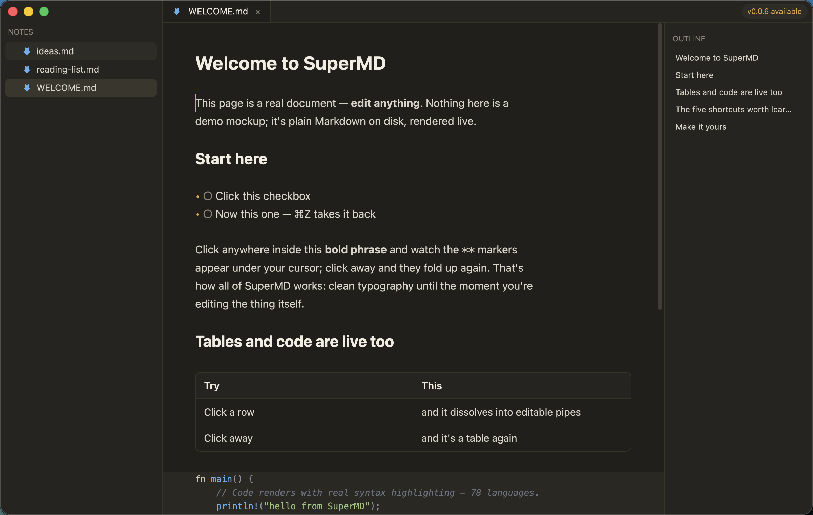

# SuperMD

[](https://github.com/SuperJackfruitLabs/supermd/actions/workflows/ci.yml)
[](https://github.com/SuperJackfruitLabs/supermd/releases/latest)
[](https://github.com/SuperJackfruitLabs/supermd/releases)
[](https://github.com/SuperJackfruitLabs/supermd/actions/workflows/ci.yml)
[](LICENSE)


**Markdown that gets out of the way.** A native, GPU-rendered Markdown
editor — the writing feel of Bear/Lettera on the engine philosophy of
Zed. Plain CommonMark on disk, always.

**[supermd.app](https://supermd.app)** ·
**[Download](https://github.com/SuperJackfruitLabs/supermd/releases/latest)** ·
built in Rust on [GPUI](https://www.gpui.rs), the UI framework behind
[Zed](https://zed.dev)



## Highlights

- **Hybrid WYSIWYG** — syntax markers hide when your cursor is
  elsewhere and reveal in place when you touch them: `**bold**`,
  headings, lists (`•`), quotes, links, task checkboxes (click to
  toggle).
- **Live blocks** — tables render as real tables and whole-line images
  render inline while you edit; touch them and they dissolve back into
  raw source. Code fences read as clean panels with tree-sitter
  highlighting.
- **Live diagrams** — ` ```mermaid ` fences render as native,
  theme-matched diagrams (merman — pure Rust, no browser). Click one
  to edit its source; click away and it's a picture again. All 35
  mermaid diagram families.
- **A real workspace** — folder sidebar with Seti UI file icons
  (gitignore-aware: no `node_modules`/`target` noise), tabs with
  VS Code-style preview behavior (arrow through files in the sidebar,
  pin with Enter or a double-click), outline panel, fuzzy file finder
  (nucleo-scored with match highlighting), find in file, pretty
  preview toggle, image viewer tabs, light/dark following the system.
- **Search in workspace** — ⌘⇧F streams ripgrep-powered results into a
  two-pane overlay: matches grouped by file, live preview centered on
  the hit, Enter jumps straight to the line.
- **78 languages highlighted** via tree-sitter (inkjet + Helix
  queries, plus an extras registry), in fenced blocks and standalone
  files alike. Code files get a real code editor: monospace, full
  width, line-number gutter, auto-indent.
- **Show Changes** — diff the open file against git HEAD, with
  word-level marks rendered in the editor's own typography (added words
  on a green wash, deleted words struck through in red, inline in the
  flow). Code files get line diffs with a diff-aware gutter; modified
  files get a dot in the sidebar. Pure-Rust git (gix), read-only —
  SuperMD never writes to your repo.
- **Themes** — eight built-in (Jackfruit ×2, Paper, Graphite,
  Solarized ×2, Nord, Gruvbox Dark), live picker, custom themes as
  TOML files in `~/.supermd/themes/`. Your light and dark picks follow
  the system appearance automatically.
- **Extensible** — plugins are WebAssembly components dropped into
  `~/.supermd/plugins/`: block renderers (` ```dot ` graphviz),
  palette commands (⌘⇧P), inline renderers (`:tada:` → 🎉),
  decoration rules (TODO highlighting needs zero code — just a
  manifest), formatters, and paste processors (CSV → table).
  Sandboxed hard: no filesystem without per-plugin consent, no
  network, no processes; a hung plugin is cut off in 2 s. Author one
  from `plugins/template/` in ~20 lines of Rust; five ship
  first-party (dot, toc, emoji, tidy, todo-marks).
- **Update aware** — a quiet launch-time check against GitHub releases
  shows an "update available" pill in the titlebar when a newer version
  ships; clicking opens the download page. Nothing phones home beyond
  that one request, and failures are silent.
- **Safe by default** — autosave with atomic writes, per-session
  backups in `~/.supermd/backups`, external-change detection that never
  silently clobbers anything, and live reload of clean buffers when
  files change on disk.

The editing core (buffer, selection, undo, styling spans, display
transform, projection) is pure Rust under a test suite; the GPU shell
stays thin.

### The five shortcuts worth learning first

| Shortcut | Does |
| -------- | ---- |
| ⌘O | open a file or folder |
| ⌘P | jump to any file by fuzzy name |
| ⌘⇧F | search inside every file in the workspace |
| ⌘⇧D | see what you've changed since your last git commit |
| ⌘T | pick a theme |

Everything else lives in ⌘/. On Linux and Windows, read ⌘ as Ctrl.

## Installing

Grab the build for your platform from the
[latest release](https://github.com/SuperJackfruitLabs/supermd/releases/latest):

**macOS** — download the DMG, drag **SuperMD** onto **Applications**, done. If you
launch it straight from the disk image instead, SuperMD notices and
offers to move itself. Releases are signed and notarized — no
Gatekeeper warnings. Double-click any `.md` file to open it ("Open
With → SuperMD" for other text), drop a folder on the window or Dock
icon to open a workspace, and SuperMD reopens your last workspace on
launch (File → Open Recent has the rest).

**Linux** *(new)* — install the `.deb`, or unpack the tarball and run
`./install.sh` (installs to `~/.local`, registers the .desktop entry
and markdown association). Wayland and X11 both supported.

**Windows** *(new)* — run `SuperMD-Setup-<version>.exe` (Start Menu
entry, optional `.md` association, uninstaller) or use the portable
zip. Builds are not yet code-signed, so SmartScreen shows one
"unrecognized app" prompt — More info → Run anyway.

## Building from source

Requires Rust (stable). On macOS no full Xcode is needed — Metal
shaders compile at runtime. On Linux install the build deps first:

```sh
sudo apt-get install libxkbcommon-dev libxkbcommon-x11-dev \
  libwayland-dev libx11-xcb-dev libxcb1-dev libfontconfig1-dev \
  libfreetype6-dev
```

```sh
cargo run            # opens an empty workspace (Open Folder… to pick one)
cargo run -- .       # open the current directory as a workspace
cargo run -- <path>  # open a file or folder
cargo test
```

## Status

Early and moving fast — built as a working editor first, a product
second. macOS is the primary platform; Linux and Windows builds are
new — [feedback and issues](https://github.com/SuperJackfruitLabs/supermd/issues)
welcome.

## License

Apache-2.0. Vendored third-party assets keep their own licenses (see
`assets/`).
