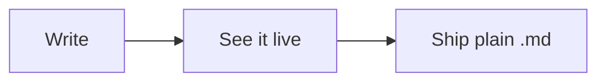

# Welcome to SuperMD

This page is a real document — **edit anything**. Nothing here is a
demo mockup; it's plain Markdown on disk, rendered live.

## Start here

- [ ] Click this checkbox
- [ ] Now this one — ⌘Z takes it back

Click anywhere inside this **bold phrase** and watch the `**` markers
appear under your cursor; click away and they fold up again. That's
how all of SuperMD works: clean typography until the moment you're
editing the thing itself.

Select a few words with the mouse and a small toolbar appears —
bold, italic, code, and friends, each a single click. **⌘B** and
**⌘I** work on selections too.

## Link your notes

Open a folder and type `[[` — every note in it is a completion away.
**⌘-click** a link to follow it (linking to a note that doesn't exist
yet creates it), and **⌘3** shows what links *back* to the note
you're reading, its `#tags`, and a live graph of the neighborhood.
Rename a note and every link to it is rewritten. No database — just
your Markdown files, indexed.

## Tables and code are live too

| Try | This |
| --- | ---- |
| Click a row | and it dissolves into editable pipes |
| Click away | and it's a table again |

```rust
fn main() {
    // Code renders with real syntax highlighting — 78 languages.
    println!("hello from SuperMD");
}
```

Even diagrams are live — this is a ` ```mermaid ` fence. Click it to
see (and edit) the source:



## The six shortcuts worth learning first

- **⌘O** — open a file or folder
- **⌘P** — jump to any file by fuzzy name
- **⌘⇧F** — search inside every file in the workspace
- **⌘3** — backlinks, tags, and the graph for the open note
- **⌘⇧D** — see what you've changed since your last git commit
- **⌘T** — pick a theme (your light/dark choices follow the system)

Everything else lives in **⌘/**.

## Make it yours

Open a folder (**⌘O**) — or just drop one onto this window. Your
notes stay plain Markdown files on your disk: no database, no lock-in,
autosaved with backups in `~/.supermd/backups`.

The full guide — shortcuts, themes, plugins, and how to write your
own — lives at [supermd.app/docs](https://supermd.app/docs/).

*Happy writing.*
