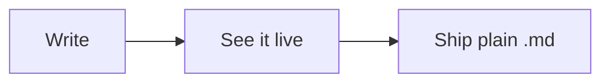

# Welcome to SuperMD

This page is a real document — **edit anything**. Nothing here is a
demo mockup; it's plain Markdown on disk, rendered live.

## Start here

- [ ] Click this checkbox
- [ ] Now this one — ⌘Z takes it back

Click anywhere inside this **bold phrase** and watch the `**` markers
appear under your cursor; click away and they fold up again. That's
how all of SuperMD works: clean typography until the moment you're
editing the thing itself.

## Tables and code are live too

| Try | This |
| --- | ---- |
| Click a row | and it dissolves into editable pipes |
| Click away | and it's a table again |

```rust
fn main() {
    // Code renders with real syntax highlighting — 78 languages.
    println!("hello from SuperMD");
}
```

Even diagrams are live — this is a ` ```mermaid ` fence. Click it to
see (and edit) the source:



## The five shortcuts worth learning first

- **⌘O** — open a file or folder
- **⌘P** — jump to any file by fuzzy name
- **⌘⇧F** — search inside every file in the workspace
- **⌘⇧D** — see what you've changed since your last git commit
- **⌘T** — pick a theme (your light/dark choices follow the system)

Everything else lives in **⌘/**.

## Make it yours

Open a folder (**⌘O**) — or just drop one onto this window. Your
notes stay plain Markdown files on your disk: no database, no lock-in,
autosaved with backups in `~/.supermd/backups`.

*Happy writing.*
