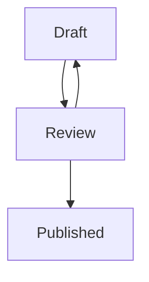
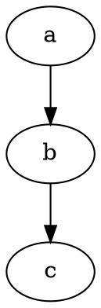

# Diagrams

Fenced code blocks in two languages render as live diagrams, right in the document.

## Mermaid

````markdown

````

Flowcharts, sequence diagrams, state machines — the common Mermaid diagram types render inline, using your current theme's colors and fonts. No web view, no external service: rendering happens locally.

## Graphviz

````markdown

````

`dot` and `graphviz` fences render through the bundled Graphviz plugin, themed to match.

## Editing a diagram

Click a diagram and it dissolves into its editable source, like every other block in SuperMD. Click away and it re-renders. If the source has a syntax error, the error message appears in the diagram's place — your document keeps working, and the raw text is one click away.

Diagrams re-render when you switch themes, so they never look pasted-in.
