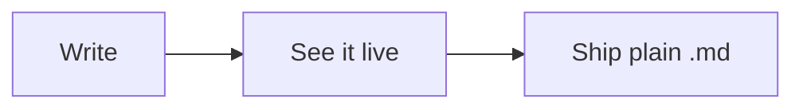

# Projector Registry & Diagram Blocks Implementation Plan

> **For agentic workers:** REQUIRED SUB-SKILL: Use superpowers:subagent-driven-development (recommended) or superpowers:executing-plans to implement this plan task-by-task. Steps use checkbox (`- [ ]`) syntax for tracking.

**Goal:** Registry-based block projection (Table/Image ported, behavior frozen) plus ` ```mermaid ` fences rendering as themed native diagrams via merman + resvg — and an editable Welcome so the tour's interactive promises are true.

**Architecture:** `projection::Item` gains a generic `Widget { projector, lines, payload }` variant; discovery is pure per-projector (`src/editor/projector.rs`), while the dissolve rule, overlap resolution, and fence-delimiter omission stay solely in `project()`. Diagrams flow mermaid→merman→SVG→resvg→`gpui::Image` on the background executor into a global cache shared by editor and reader.

**Tech Stack:** `merman =0.8.0-alpha.5` (pinned exact), `resvg 0.48`, GPUI 0.2.2 (`ImageSource::Image`).

**Spec:** `docs/superpowers/specs/2026-08-24-diagram-blocks-design.md`

## Global Constraints

- Port gate: projection semantics unchanged — existing projection tests updated *mechanically* to the new `Item` shape only; every other test in the suite passes untouched.
- Dissolve/overlap/fence-omission logic lives only in `project()`; projectors never see the selection.
- merman pinned `=0.8.0-alpha.5`; diagram failures degrade to the highlighted code fence + error strip, never hide source.
- All merman/resvg work on the background executor; UI reads the cache only.
- TDD; full suite green before each commit.

---

### Task 1: Editable Welcome (bug fix — tour promises interactivity)

**Files:** Modify `src/workspace.rs` (welcome tab creation), `src/reader.rs` only if the embedded source constant lives there.

**Interfaces — Produces:** `workspace::welcome_editor_path() -> PathBuf` (`~/.supermd/Welcome.md`); the no-arg/first-run welcome tab becomes `Tab::Editor`.

- [ ] **Step 1: Failing test** (pure, in workspace tests):

```rust
#[test]
fn welcome_file_written_once_and_reused() {
    let dir = tempfile::tempdir().unwrap();
    let p = ensure_welcome_file(dir.path());
    assert!(p.ends_with("Welcome.md"));
    let first = std::fs::read_to_string(&p).unwrap();
    assert!(first.contains("Welcome to SuperMD"));
    std::fs::write(&p, "user edited").unwrap();
    ensure_welcome_file(dir.path());
    assert_eq!(std::fs::read_to_string(&p).unwrap(), "user edited"); // never clobbered
}
```

`pub(crate) fn ensure_welcome_file(config_dir: &Path) -> PathBuf` — writes `include_str!("../WELCOME.md")` to `config_dir/Welcome.md` iff absent.

- [ ] **Step 2:** RED → implement → green.

- [ ] **Step 3:** In `Workspace::new`'s `None` arm (and wherever the welcome Reader is created for first-run): `let p = ensure_welcome_file(&crate::settings::config_dir());` then open as `Tab::Editor` via the same construction `open_path` uses (`Editor::read_file` + `Editor::from_text`). Reader::welcome stays for nothing — delete it if now unused (and its imports).

- [ ] **Step 4:** Manual smoke: launch bare with no recents (move settings aside) → Welcome opens editable; checkboxes toggle; edits persist to `~/.supermd/Welcome.md`. Full suite. Commit `fix: welcome opens as an editable document`.

Note (recorded follow-up, not in scope): toggling checkboxes from inside ⌘E preview.

---

### Task 2: Projector registry — types + port

**Files:** Create `src/editor/projector.rs`; modify `src/editor/projection.rs`, `src/editor/mod.rs` (restyle/reproject/list closure/`mod projector;`)

**Interfaces — Produces:**

```rust
// projector.rs
pub struct Claim {
    pub lines: std::ops::Range<usize>,   // source lines consumed
    pub bytes: std::ops::Range<usize>,   // for the central touch test
    pub payload: std::sync::Arc<dyn std::any::Any + Send + Sync>,
}
pub trait Projector: Send + Sync + 'static {
    fn name(&self) -> &'static str;
    fn discover(&self, text: &str, blocks: &[super::blocks::BlockInfo],
                lines: &[std::ops::Range<usize>]) -> Vec<Claim>;
    fn render(&self, ctx: &mut WidgetCtx<'_>) -> gpui::AnyElement;
}
pub struct WidgetCtx<'a> {
    pub editor: &'a gpui::Entity<super::Editor>,
    pub item_ix: usize,
    pub lines: std::ops::Range<usize>,
    pub payload: &'a std::sync::Arc<dyn std::any::Any + Send + Sync>,
    pub theme: &'a crate::theme::Theme,
    pub cx: &'a mut gpui::App,
}
pub fn projectors() -> &'static [&'static dyn Projector]; // [TableProjector, ImageProjector, DiagramProjector(Task 5)]
pub fn discover_all(text: &str, blocks: &[BlockInfo], lines: &[Range<usize>]) -> Vec<(usize, Claim)>;
pub struct TablePayload;                                  // lines suffice
pub struct ImagePayload { pub alt: String, pub dest: String }
```

```rust
// projection.rs
pub enum Item {
    Line(usize),
    Widget { projector: usize, lines: Range<usize>,
             payload: Arc<dyn Any + Send + Sync> },
}
impl PartialEq for Item { /* Line==Line by ix; Widget==Widget by (projector, lines) */ }
pub fn project(lines: &[Range<usize>], blocks: &[BlockInfo],
               claims: &[(usize, Claim)], selection: Range<usize>) -> Vec<Item>;
```

- [ ] **Step 1: Rewrite projection tests to the new shape** (semantics identical — these are the spec of the port). Table/Image assertions become claim-driven; fence tests unchanged in intent:

```rust
fn table_claim(lines: &[Range<usize>], byte_range: Range<usize>) -> (usize, Claim) {
    let first = line_of_byte(lines, byte_range.start);
    let last = line_of_byte(lines, byte_range.end.max(byte_range.start + 1) - 1);
    (0, Claim { lines: first..last + 1, bytes: byte_range,
                payload: std::sync::Arc::new(crate::editor::projector::TablePayload) })
}

#[test]
fn untouched_claim_becomes_one_widget() {
    let src = "a\n\n|h|\n|-|\n|1|\n\nb";
    let lines = lines_of(src);
    let claims = [table_claim(&lines, 3..15)];
    let items = project(&lines, &[], &claims, 0..0);
    assert_eq!(items.len(), 5);
    assert!(matches!(&items[2], Item::Widget { projector: 0, lines: l, .. } if *l == (2..5)));
}

#[test]
fn touched_claim_dissolves() {
    let src = "a\n\n|h|\n|-|\n|1|\n\nb";
    let lines = lines_of(src);
    let claims = [table_claim(&lines, 3..15)];
    for sel in [3..3, 10..10, 15..15, 1..4] {
        let items = project(&lines, &[], &claims, sel);
        assert!(items.iter().all(|i| matches!(i, Item::Line(_))));
    }
    assert_eq!(project(&lines, &[], &claims, 16..16).len(), 5);
}

#[test]
fn overlapping_claims_first_wins() {
    let src = "x\ny\nz";
    let lines = lines_of(src);
    let a = (0, Claim { lines: 0..2, bytes: 0..3, payload: Arc::new(TablePayload) });
    let b = (1, Claim { lines: 1..3, bytes: 2..5, payload: Arc::new(TablePayload) });
    let items = project(&lines, &[], &[a, b], 100..100);
    assert!(matches!(&items[0], Item::Widget { projector: 0, .. }));
    assert!(matches!(items[1], Item::Line(2))); // loser dropped entirely
}
```

(Fence omission tests keep passing `blocks` for the skip set; claims list empty.)

- [ ] **Step 2:** RED (new signature/types absent) → implement `project()`: same widget-planning loop but driven by `claims` sorted by `(lines.start, projector_ix)`; the `touched` test uses `claim.bytes`; fence skip-set logic stays as-is from `blocks`. `item_of_line` updated for `Widget`.

- [ ] **Step 3:** Implement `projector.rs`: `TableProjector::discover` = today's `BlockKind::Table` arm (line math verbatim from projection.rs:56-68); `ImageProjector::discover` = the `Image` arm; `render` impls move the bodies of `render_table` / `render_image` (mod.rs:1638/1718) behind the trait, downcasting payloads (`ImagePayload` carries alt/dest; table widget re-reads lines from the buffer exactly as today).

- [ ] **Step 4:** Wire `mod.rs`: `restyle`/`compute_projection` compute `let claims = projector::discover_all(&text, &self.blocks, &line_ranges)` (claims stored on Editor beside `blocks`); list closure's `Item::Table`/`Item::Image` arms become one `Item::Widget` arm calling `projectors()[p].render(&mut WidgetCtx {..})` wrapped in the existing `column(..)`.

- [ ] **Step 5:** Full suite green (the gate). Commit `refactor: projector registry for block widgets`.

---

### Task 3: Diagram engine — `src/diagram.rs`

**Files:** Create `src/diagram.rs`; modify `src/main.rs` (`mod diagram;`), `Cargo.toml`

**Interfaces — Produces:** `diagram::{DiagramTheme, to_svg(source, &DiagramTheme) -> Result<String, String>, rasterize(svg, scale) -> Result<(Vec<u8> /*PNG*/, u32, u32), String>}`; `DiagramTheme::from_theme(&Theme) -> Self` and `fingerprint() -> u64`.

- [ ] **Step 1:** `cargo add merman@=0.8.0-alpha.5 resvg@0.48` (trim resvg default features if text rendering pulls heavy font machinery we don't need — diagrams carry their own text as paths or we keep resvg's text feature ON since mermaid SVGs use `<text>`; decide by compiling: text support IS required, keep it).

- [ ] **Step 2: Failing tests**

```rust
#[test]
fn flowchart_renders_to_svg_with_labels() {
    let t = DiagramTheme::default_light();
    let svg = to_svg("flowchart LR\n  a[Start] --> b[End]\n", &t).unwrap();
    assert!(svg.contains("Start") && svg.contains("End"));
}

#[test]
fn bad_source_reports_error() {
    let t = DiagramTheme::default_light();
    let err = to_svg("flowchart LR\n  a --> \n  %%garbage%% -->>>", &t)
        .err().or(Some(String::new())).unwrap();
    // merman may tolerate more than mermaid.js; accept either a parse
    // error or (if it renders) skip — assert via a definitely-invalid header:
    assert!(to_svg("not_a_diagram_type_xyz\n  a --> b", &t).is_err());
    let _ = err;
}

#[test]
fn rasterize_produces_scaled_png() {
    let svg = r##"<svg xmlns="http://www.w3.org/2000/svg" width="100" height="50"><rect width="100" height="50" fill="#c9821c"/></svg>"##;
    let (png, w, h) = rasterize(svg, 2.0).unwrap();
    assert_eq!((w, h), (200, 100));
    assert_eq!(&png[..8], b"\x89PNG\r\n\x1a\n");
}

#[test]
fn theme_fingerprint_tracks_fields() {
    let a = DiagramTheme::default_light();
    let b = DiagramTheme::default_dark();
    assert_ne!(a.fingerprint(), b.fingerprint());
    assert_eq!(a.fingerprint(), DiagramTheme::default_light().fingerprint());
}
```

- [ ] **Step 3:** RED → implement. `DiagramTheme { background, primary, text, muted, border: String /*#rrggbb*/, font_body, font_mono: String, dark: bool }` with `from_theme` (hex-format the Hsla values — add a small `hex(color: Hsla) -> String` via hsla→rgb conversion) and `default_light/default_dark` for tests. `to_svg`: merman's render API with mermaid config `{"theme":"base","themeVariables":{...}}` built from the fields (exact call per merman docs.rs; if the alpha API only takes raw mermaid source, prepend an init directive comment `%%{init: {...}}%%` — mermaid-standard and merman-parity, guaranteed available). `rasterize`: `usvg::Tree::from_str` with default options + fontdb loading system fonts once (`std::sync::OnceLock<fontdb::Database>`), render to `tiny_skia::Pixmap` at scale, `encode_png()`.

- [ ] **Step 4:** Green, full suite, commit `feat: mermaid-to-image diagram engine (merman + resvg)`.

---

### Task 4: Diagram cache — global + background renders

**Files:** Modify `src/diagram.rs` (cache types), `src/main.rs` (set_global)

**Interfaces — Produces:**

```rust
pub struct DiagramKey { pub source_hash: u64, pub theme_fingerprint: u64, pub width_bucket: u32 }
pub enum DiagramState { Pending, Ready(std::sync::Arc<gpui::Image>), Failed(String) }
pub struct DiagramCache { map: HashMap<DiagramKey, DiagramState>, order: VecDeque<DiagramKey> } // cap 128, insertion-order evict
impl gpui::Global for DiagramCache {}

/// Cache lookup; on miss inserts Pending and spawns the background
/// render (to_svg + rasterize), storing Ready/Failed and cx.refresh().
pub fn diagram_state(source: &str, width: f32, cx: &mut gpui::App) -> DiagramState; // returns a clone
```

- [ ] **Step 1: Failing tests** (pure parts):

```rust
#[test]
fn cache_evicts_oldest_beyond_cap() {
    let mut c = DiagramCache::default();
    for i in 0..130u64 {
        c.insert(DiagramKey { source_hash: i, theme_fingerprint: 0, width_bucket: 704 },
                 DiagramState::Pending);
    }
    assert!(c.len() <= 128);
    assert!(c.get(&DiagramKey { source_hash: 0, theme_fingerprint: 0, width_bucket: 704 }).is_none());
    assert!(c.get(&DiagramKey { source_hash: 129, theme_fingerprint: 0, width_bucket: 704 }).is_some());
}

#[test]
fn width_buckets_round_to_64() {
    assert_eq!(DiagramKey::bucket(700.0), 704);
    assert_eq!(DiagramKey::bucket(650.0), 640);
}
```

- [ ] **Step 2:** RED → implement cache struct (+ `insert/get/len`, `bucket = (w / 64).round() * 64`), then `diagram_state`: read theme (`theme(cx)`) → `DiagramTheme::from_theme` → key; on miss insert Pending, `cx.background_executor().spawn` producing the PNG, then `cx.spawn` update: `gpui::Image::from_bytes(gpui::ImageFormat::Png, png)` (verify exact constructor in vendored gpui; `ImageSource::Image(Arc<Image>)` is confirmed) → store → `cx.refresh()`.

- [ ] **Step 3:** Green, full suite, commit `feat: global diagram render cache`.

---

### Task 5: Diagram projector

**Files:** Modify `src/editor/projector.rs`, `src/editor/mod.rs` (register), `src/editor/spans.rs` only if `fence_infos` needs pub(crate) widening

**Interfaces:**
- Consumes: `spans::fence_infos` (`FenceInfo { block, body, lang, fenced }`), `diagram::diagram_state`, Task 2's trait.
- Produces: `DiagramProjector` registered third; `DiagramPayload { body: String }`.

- [ ] **Step 1: Failing discovery tests** (in projector.rs):

```rust
#[test]
fn mermaid_fences_claimed_others_not() {
    let src = "```mermaid\nflowchart LR\n a-->b\n```\n\n```rust\nfn x(){}\n```\nrest";
    let lines = lines_of(src); // reuse test helper
    let claims = DiagramProjector.discover(src, &[], &lines);
    assert_eq!(claims.len(), 1);
    assert_eq!(claims[0].lines, 0..4); // whole fence incl. delimiters
    let p = claims[0].payload.downcast_ref::<DiagramPayload>().unwrap();
    assert!(p.body.contains("flowchart"));
}

#[test]
fn unclosed_mermaid_fence_not_claimed() {
    let src = "```mermaid\nflowchart LR";
    let lines = lines_of(src);
    assert!(DiagramProjector.discover(src, &[], &lines).is_empty());
}
```

- [ ] **Step 2:** RED → implement `discover` via `fence_infos(text)` filtered to `lang == Some("mermaid")` && closed (fence_infos exposes the block range; closed-ness comes from the matching `BlockKind::Fence.close_line` or from the info's own shape — use whichever field the actual struct provides, asserting the unclosed case in the test).

- [ ] **Step 3:** `render`: call `diagram::diagram_state(&payload.body, 664.0 /*column width px*/, ctx.cx)`; match:
  - `Ready(img)` → `div().w_full().flex().justify_center().child(gpui::img(img).max_w_full().rounded_md())`
  - `Pending` → rounded box, `min_h(px(120.))`, `code_bg`, centered muted "diagram…"
  - `Failed(msg)` → column: slim strip (`diff_deleted_bg` bg, `diff_deleted_fg` text, `text_size 11`) with msg, then the raw fence lines rendered as plain mono text block (`code_bg`) — the projection still claimed the lines, so we print `payload.body` mono; clicking anywhere dissolves to the real editable fence as usual.
  Register in `projectors()` after Table, Image.

- [ ] **Step 4:** Full suite; manual smoke: mermaid fence in a scratch doc renders, click dissolves, syntax error shows strip. Commit `feat: mermaid diagram blocks in the editor`.

---

### Task 6: Reader/preview diagrams + welcome flowchart

**Files:** Modify `src/view.rs`, `WELCOME.md`

- [ ] **Step 1:** `view.rs::code_block` (or the `Block::Code` arm in `block()`): when `lang == Some("mermaid")`, render via `diagram::diagram_state` with the same three states (Ready image / Pending box / Failed strip + fall through to the normal highlighted code block). Reader has `&Theme` but needs `cx: &mut App` — check the call chain: `view::list_item(doc, ix, t)` has no cx today. Extend `list_item` and `block()` signatures with `cx: &mut gpui::App` (Reader's render passes it through — mechanical signature change, compiler-guided).

- [ ] **Step 2:** WELCOME.md: add under the table/code section:

````markdown

````

- [ ] **Step 3:** Full suite; manual smoke: welcome (now editable, Task 1) shows the rendered flowchart; ⌘E preview of a mermaid doc shows it too. Commit `feat: diagrams in reader, preview, and the welcome tour`.

---

### Task 7: Docs + finish

- [ ] **Step 1:** README: feature bullet — "**Live diagrams** — ` ```mermaid ` fences render as native, theme-matched diagrams (merman, no browser); click one to edit its source, click away and it's a picture again." HISTORY.md phase row.
- [ ] **Step 2:** Full suite + release build + combined smoke (welcome interactivity, diagrams in editor/preview, existing tables/images regression eyeball).
- [ ] **Step 3:** Commit `docs: diagram blocks in README`, push. Offer v0.0.5 (user's call).
