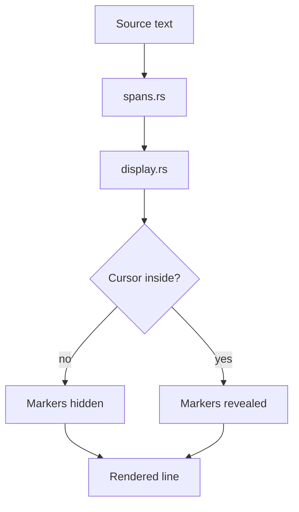
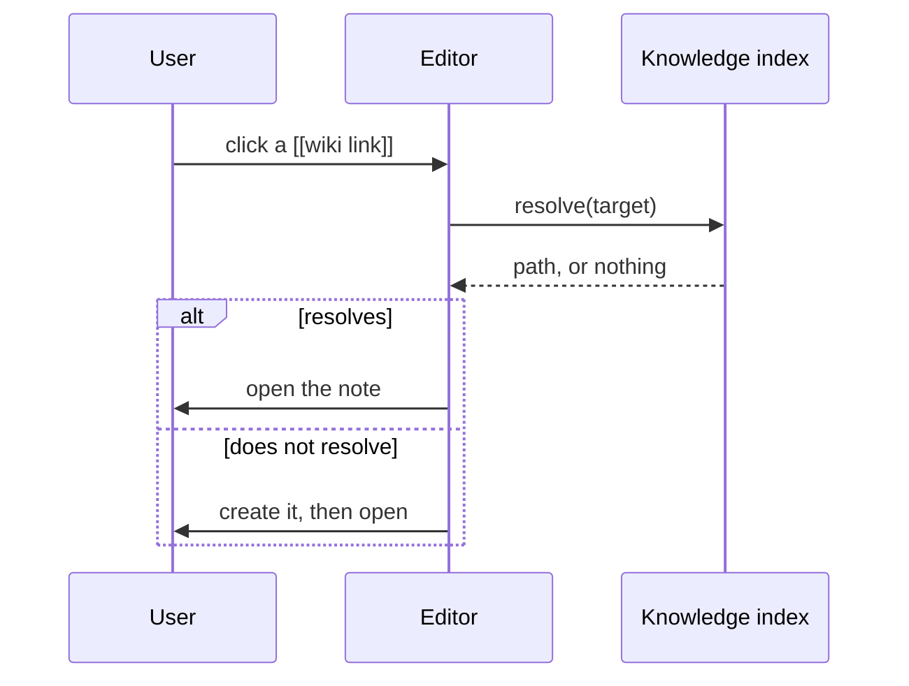
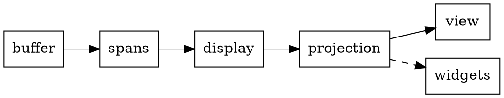

# Diagrams

Mermaid is built in. Graphviz DOT arrives via the bundled `dot` plugin.
Both render on a background thread and are cached — the UI only ever
reads the cache, so a complex diagram never blocks typing.

Like tables, a diagram is a claimed block: it renders as a picture
while the cursor is outside it, and returns to source when you enter.

#guide #diagrams

## Mermaid: a flowchart



## Mermaid: a sequence diagram



## Graphviz, via the `dot` plugin



## A deliberately broken diagram

The block below is not valid Mermaid. It should show an error in place
rather than blanking the document or taking the app down.

```mermaid
flowchart TD
    this is not --> valid ((mermaid
```

Next: [[Plugins]]
